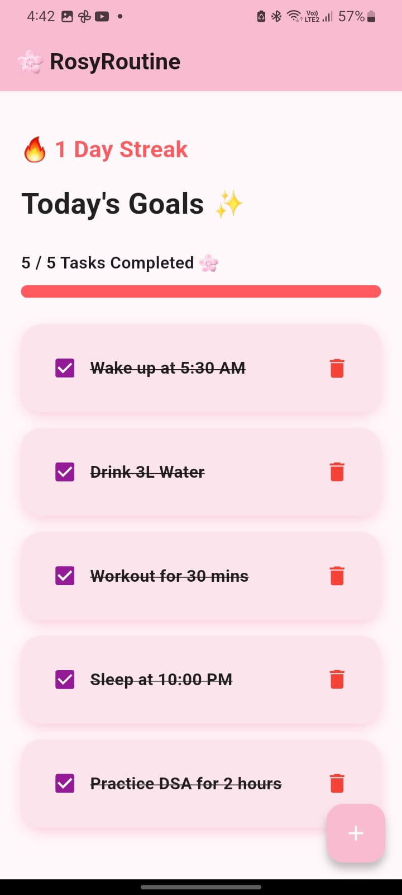
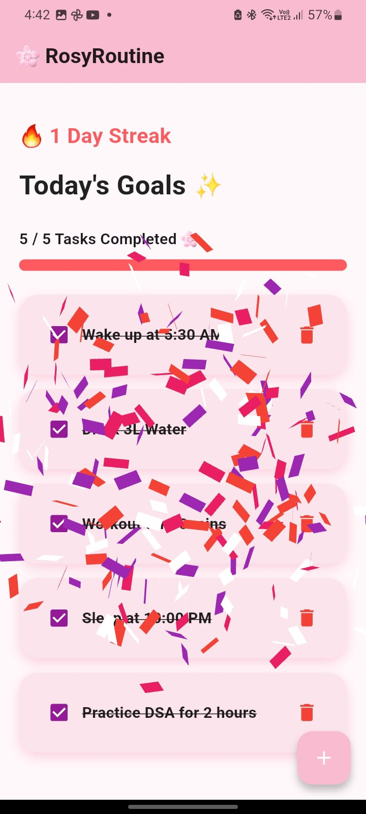
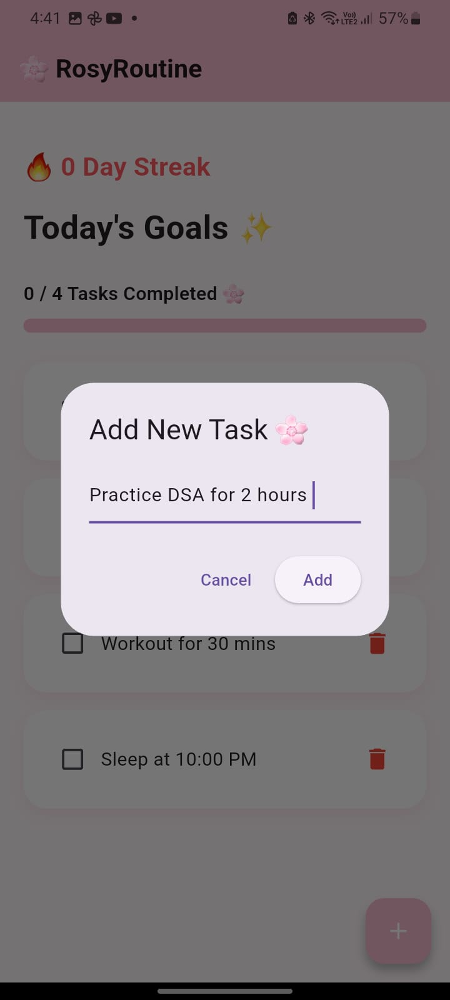
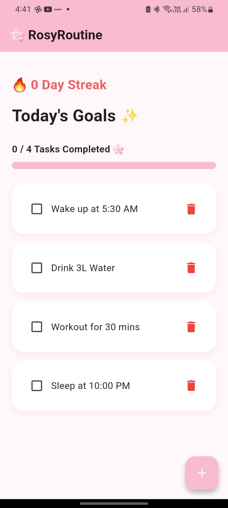

# 🌸 RosyRoutine

<p align="center">
  
</p>

<p align="center">
  
  
  
  
  
</p>

<p align="center">
  <b>Build Better Habits. Stay Consistent. Grow Every Day. 💖</b>
</p>

<p align="center">
  A cute productivity app focused on consistency, routines, and self-growth.
</p>

---

## 📖 Overview

RosyRoutine is a beautifully designed Flutter productivity application that helps users organize their daily routines, maintain healthy habits, and stay consistent with their goals.

The app combines habit tracking, daily task management, streak monitoring, progress visualization, and rewarding animations to create an engaging productivity experience.

Designed with simplicity and motivation in mind, RosyRoutine helps users focus on building long-term consistency rather than temporary motivation.

Whether it’s studying, fitness, hydration, meditation, coding practice, or self-care routines, RosyRoutine provides a clean and aesthetic environment that motivates users to complete their goals every single day.

---

## ✨ Features

### ✅ Daily Task Management

* Add and manage daily tasks effortlessly
* Mark tasks as completed throughout the day
* Simple and distraction-free workflow
* Smooth animated task cards

### 📊 Progress Tracking

* Real-time completion percentage
* Beautiful animated progress bar
* Easy monitoring of daily performance

### 🔥 Streak System

* Track consecutive successful days
* Build consistency through habit streaks
* Streak resets automatically when a day is missed

### 🎉 Achievement Celebration

* Confetti celebration when all tasks are completed
* Rewarding user experience
* Motivation-driven productivity system

### 💾 Local Data Storage

* Offline-first experience
* Persistent task saving using SharedPreferences
* No internet connection required
* Fast and lightweight performance

### 🎨 Modern User Interface

* Elegant pink aesthetic design
* Soft modern UI components
* Smooth animations using Flutter Animate
* Beginner-friendly and easy-to-use interface

### ⚡ Automatic Daily Reset

* Tasks reset automatically every new day
* Daily routine remains fresh
* Streak system stays preserved correctly

### 🗑️ Easy Task Deletion

* Delete unwanted tasks instantly
* Clean and manageable task list

---

## 📸 Screenshots

<p align="center">
  
  
  
  
</p>

---

## 📱 Download APK

<p align="center">
  <a href="https://github.com/Suguna-garagapati/RosyRoutine/releases">
    
  </a>
</p>

---

## 🛠 Tech Stack

| Technology        | Usage                |
| ----------------- | -------------------- |
| Flutter           | UI Development       |
| Dart              | Programming Language |
| SharedPreferences | Local Storage        |
| Flutter Animate   | Smooth Animations    |
| Confetti          | Celebration Effects  |

---

## 📂 Project Structure

```bash
RosyRoutine/
├── android/
├── ios/
├── assets/
├── lib/
├── pubspec.yaml
└── README.md
```

---

## 🚀 Getting Started

### Clone Repository

```bash
git clone https://github.com/Suguna-garagapati/RosyRoutine.git
```

### Open Project

```bash
cd RosyRoutine
```

### Install Dependencies

```bash
flutter pub get
```

### Run Application

```bash
flutter run
```

---

## 🌸 Future Improvements

* 🔔 Push Notifications
* 🌙 Dark Mode
* ☁️ Firebase Cloud Sync
* 👤 User Authentication
* 📅 Calendar-based Habit Tracking
* 📈 Weekly Productivity Analytics
* 🎵 Motivational Sounds & Themes

---

## 👩‍💻 Developer

### Suguna Garagapati

💖 Passionate Flutter Developer
🌱 Learning DSA, Mobile App Development & UI Design

GitHub:
https://github.com/Suguna-garagapati

---

## ⭐ Support

If you found this project useful, please consider giving it a ⭐ on GitHub.

It helps support the project and motivates further development 🌸

---

## 📜 License

This project is open-source and available under the MIT License.
